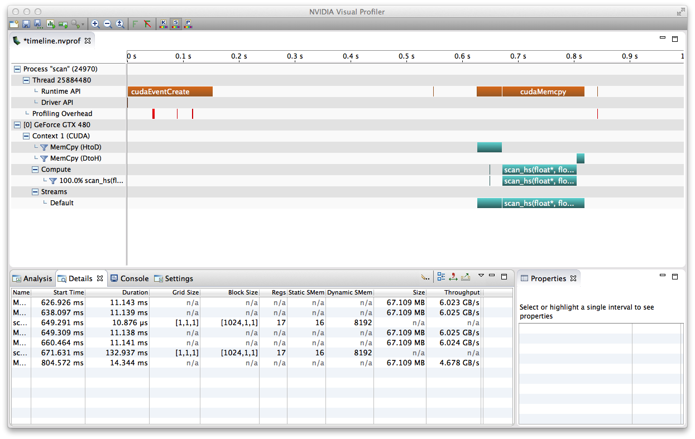

(A) In each iteration, this tiled-solution handles BLOCK_SIZE consecutive elements of the array and pass the sum of the subarray to the next iteration to push the next iteration forward, which will be able to deal with more than 2048 elements.

(B) Implement a work scan algorithm to get O(nlog(n)) performance with Hillis and Steele's.

(C) This solution can handle non-power of 2 array sizes by discarding the invalid out-of-bound values.

(D) This solution has shared memory bank conflicts since the strides are the power of 2.

> Usage: ./scan [arguments]

> Profiling: sbatch scriptTiming.sh

Results

Time cost: 

Processing 16777216 elements...
 
Host CPU Processing time: 78.476257 (ms)
 
GPU inclusive time: 169.659515 (ms)
 
Speedup: 0.462551X
 
Test PASSED

Profiling:

From the profiling above, 

Memcpy DtoH: duration = 14.344ms , throughput = 4.678GB/s

Memcpy HtoD: avg. duration = 11.141ms , avg. throughput = 6.024GB/s

GPU executing: duration = 132.937ms